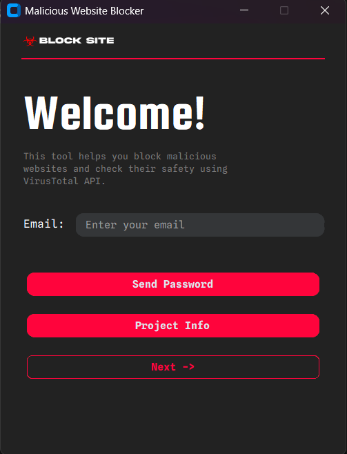
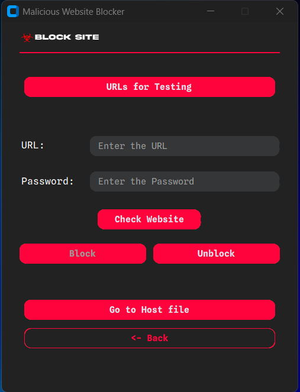
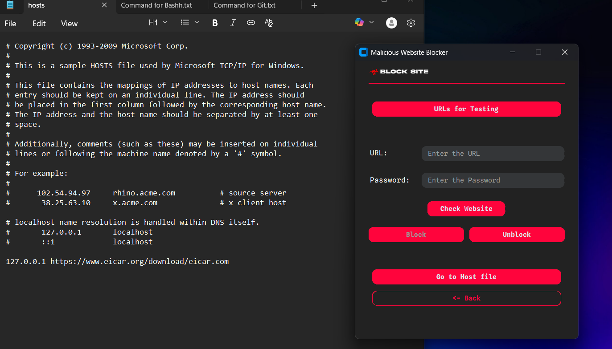
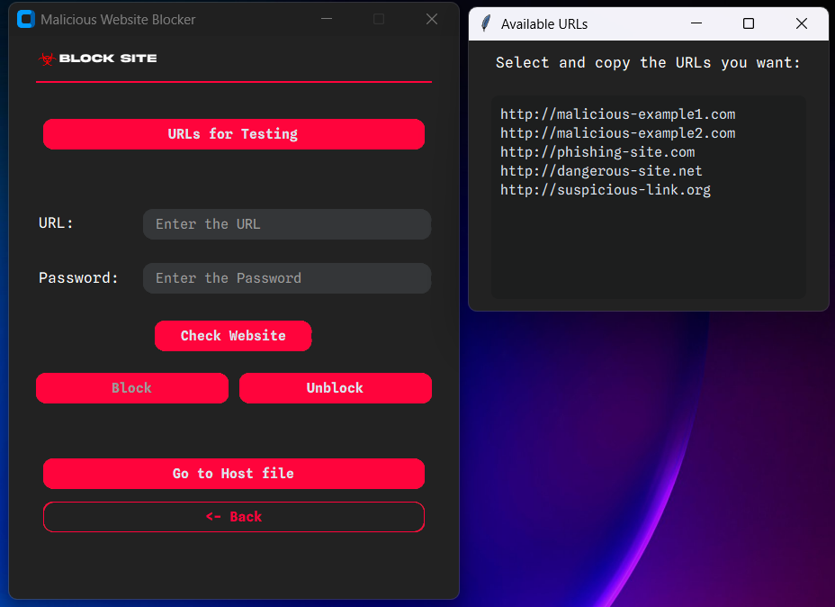

# Malicious Website Blocker

A **GUI-based desktop application** built with **Python** and **CustomTkinter** that helps users **check, block, and unblock malicious websites** using the **VirusTotal API**.  
It also supports **email-based password generation** and direct access to the system's `hosts` file.

---

## Features

-  **VirusTotal Integration** — Checks if a website is safe or malicious.
-  **Website Blocking & Unblocking** — Adds or removes entries in your system’s `hosts` file to block websites.
-  **Email Password System** — Generates a random password and sends it to your email via Gmail SMTP.
-  **Direct Hosts File Access** — Opens the `hosts` file with administrator/root privileges.
-  **Test URLs** — Provides a list of sample malicious URLs for testing.
-  **Custom UI** — Built using **CustomTkinter** and custom fonts for a clean and modern interface.

---

## Tech Stack

| Component | Technology |
|------------|-------------|
| **Language** | Python 3 |
| **GUI** | CustomTkinter |
| **APIs** | VirusTotal Public API |
| **Email** | smtplib with Gmail SMTP |
| **Other Libraries** | tkinter, Pillow, requests, platform, subprocess |

---

## Installation & Setup

### 1. Clone the repository
```bash
git clone https://github.com/<your-username>/<repo-name>.git
cd <repo-name>
```

### 2. Install dependencies
Make sure you have **Python 3** installed, then install required packages:
```bash
pip install -r requirements.txt
```

#### Example `requirements.txt`
```bash
customtkinter
Pillow
requests
tkextrafont
```

### 3. Set your VirusTotal API key
Replace the placeholder in the code:
```python
VIRUSTOTAL_API_KEY = "YOUR_API_KEY_HERE"
```

### 4. Configure Gmail for password sending
Enable **2-Step Verification** on your Gmail.  
Generate an **App Password** and update the script:
```python
sender_email = "youremail@gmail.com"
sender_password = "your-app-password"
```

---

## Usage

Run the application:
```bash
python testfile.py
```

Then:
1. Enter your email and click **Send Password**.
2. Check your inbox for the generated password.
3. Enter a URL and password to:
   - Check safety with VirusTotal.
   - Block unsafe websites.
   - Unblock them when needed.

> **Note:** You must run this script as **Administrator (Windows)** or **root (Linux/macOS)** to modify the `hosts` file.

---

## Project Structure

```bash
├── assets/
│ ├── image.png
│ ├── splinesans.ttf
│ ├── squada.ttf
│ ├── SplineSansMono-italic-VariableFont_wght.ttf
│ ├── info.pdf
├── ui/
│ ├── frame1_home.py
│ ├── frame2_blocker.py
├── utils/
│ ├── emails_utils.py
│ ├── helpers.py
│ ├── hosts_manager.py
│ ├── virustotal.py
├── main.py
```
---

## Images

### Interface


### Interface 2


### Writing into hostfile 


### Clipboard



---

## Troubleshooting

| Issue | Solution |
|--------|-----------|
| **Permission Denied Error** | Run the program as administrator/root. |
| **Email Not Sending** | Ensure Gmail App Password is set correctly. |
| **VirusTotal Error** | Check if your API key is valid and not rate-limited. |


## 👨‍💻 Author

**Padmesh S**  
🔗 [GitHub Profile](https://github.com/PadmeshSs)
